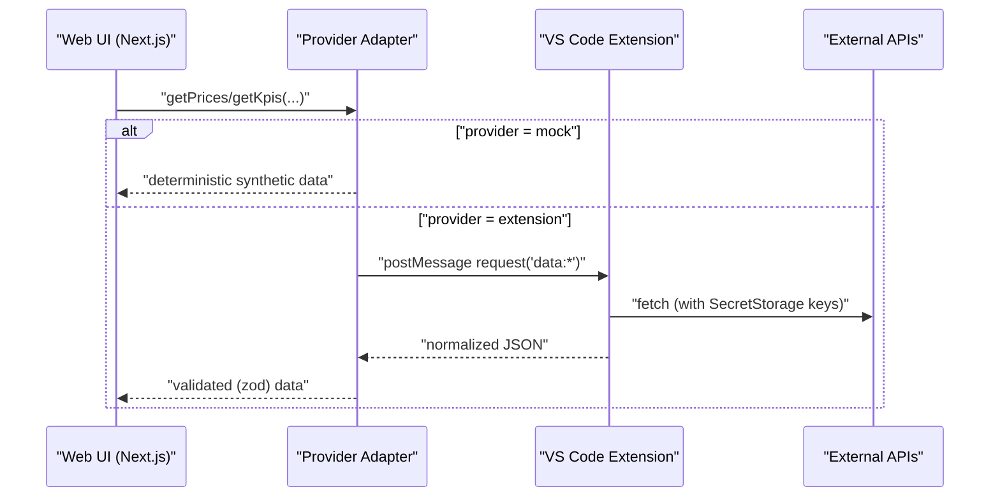

# Ive-inspired Design Notes

This codebase applies a minimalist, Jonathan Ive–inspired philosophy across the UI. Key principles and how they map to implementation:

- Radical simplification: Title bar reduced to a single centered label (`components/chrome/TitleBar.tsx`). Status bar consolidates secondary details behind a summary popover.
- Contextual actions: Widget headers show actions on hover (`components/editor/WidgetTile.tsx`), reducing persistent button noise.
- Consistent spacing: 8px grid sweep across buttons, inputs, tabs, menus; standardized control heights (buttons/inputs/select triggers to h-8 by default).
- Subtle motion: Open/close transitions use 150–200ms durations with fade/zoom/slide for dialogs, popovers, drawers, hover cards, tooltips.

Applied tokens and motion presets:

- Neutrals (globals.css):
  - `--background: hsl(0 0% 99%)`, `--foreground: hsl(0 0% 9%)`
  - `--muted: hsl(0 0% 96%)`, `--border: hsl(0 0% 92%)`

- Control sizing:
  - Buttons: default h-8, sm h-7, lg h-9, icon h-8 (`components/ui/button.tsx`)
  - Inputs/select triggers: h-8 with px-3, py-1.5
  - Tabs: list h-8; trigger px-2.5

- Motion durations (150–200ms) via Radix data-state classes:
  - Dialog/Drawer/Popover/Dropdown/ContextMenu/HoverCard/Tooltip: `data-[state=open]:duration-200` and `data-[state=closed]:duration-150`, with fade/zoom/slide utilities applied in each component file under `components/ui/`.

Contributor guidance:

- Prefer progressive disclosure: hide non-essential controls until hover/focus.
- Adhere to the 8px spacing rhythm and standardized control sizes.
- Use existing primitives (`components/ui/*`) to inherit spacing/motion presets.
- Keep focus-visible consistent; avoid overriding the global ring unless necessary for accessibility.

## Progressive Disclosure Patterns

- Chrome: Primary actions remain visible; secondary items (e.g., ActivityBar bottom icons, Explorer resizer/toggles) fade in on container hover/focus within 150–200ms.
- Panels: Headers keep labels readable; auxiliary controls (maximize/close) reveal on hover/focus.
- Widgets: Header toolbars and export/refresh actions use `group-hover` and `focus-within` to reveal with `duration-200` transitions; controls adhere to h-6–h-8 sizes depending on context.
- Menus: Consistent `p-2` containers, `py-2` items, and `-mx-2 my-2` separators ensure a tight 8px rhythm.

## MAD LAB MVP Architecture

- Web app: Next.js app dir, static export (output: export), Zustand store with migrations.
- Data providers: runtime-switchable between mock (offline) and extension (VS Code webview bridge).
- Validation: Zod schemas in `lib/data/schemas.ts` guard payloads at the boundary.
- Widgets: lightweight schema-driven registry (`lib/widgets`) with lazy runtime components.
- Agent: local tool runner with minimal intent parsing; optional LLM proxy via extension.
- Extension: VS Code webview host with CSP nonce; proxies data and secrets via SecretStorage.

Data flow

Key directories

- `lib/data/`: providers, adapters, hooks, schemas
- `components/widgets/`: widget implementations and definitions
- `lib/widgets/`: registry and loader
- `apps/extension/`: VS Code extension host and messaging
